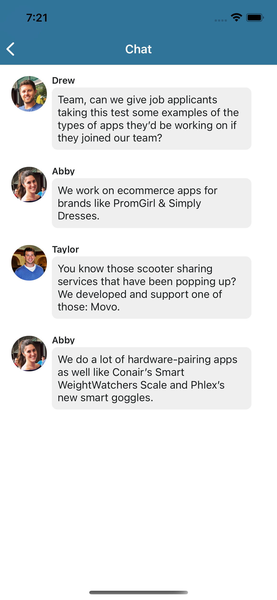
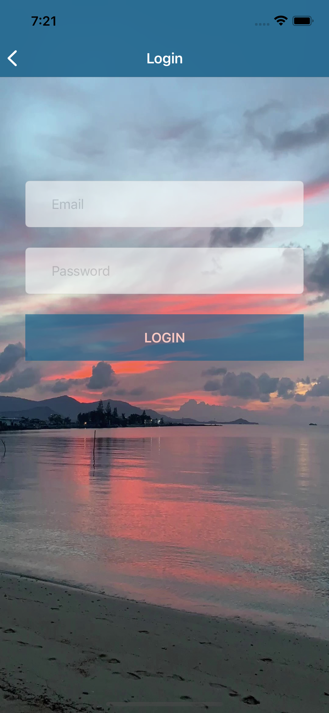
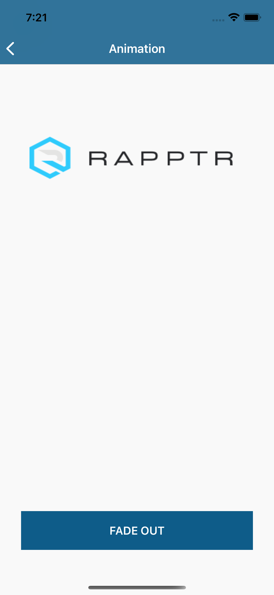

# RAPPTR 

Displays ...........

## How to use
Please open and run the ```_________.xcworkspace``` file to view the project. 

## App Screenshots

 |  | 

## Dependency Manager

[Cocoapods](https://cocoapods.org/)

