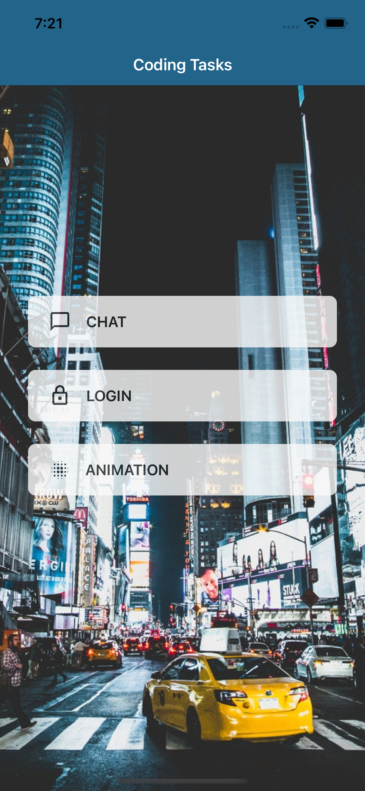

# Rapptr Labs 
Code Test - Swift app with chat, login, and animation features.  

## How to use
Please open and run the ```Rapptr IOS Test.xcworkspace``` file to view the project. 

## App Screenshots

 |   | 

## Dependency Manager

[Cocoapods](https://cocoapods.org/)

### Dependencies

- [SDWebImageSwiftUI](https://github.com/SDWebImage/SDWebImageSwiftUI)

### To reinstall pods on Apple M1*

```bash
sudo arch -x86_64 gem install ffi
arch -x86_64 pod install
```

### Support 

- Built using Xcode 12.4
- Tested on iOS 14.0
